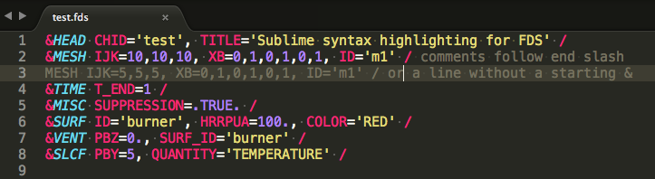

# SublimeFDS
[Sublime Text](https://www.sublimetext.com/) syntax highlighting for [FDS](https://pages.nist.gov/fds-smv/) input files

Here is an example using the "Monokai" Color Scheme:

This syntax is based on the Sublime Fortran Namelist syntax.  The main differences are that namelist groups and parameters must be valid FDS inputs to be highlighted and there is better treatment of comments.

Pull requests welcome!
